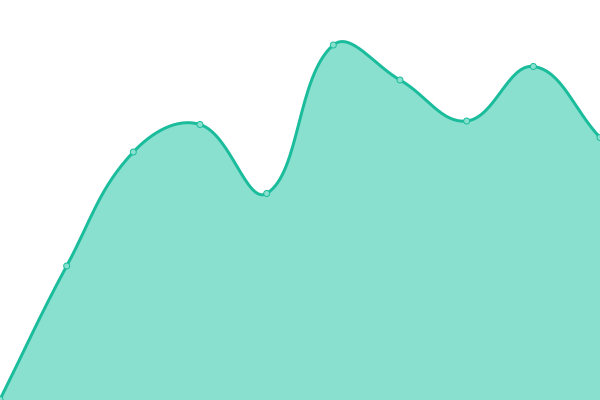

# [📈 Live Status](https://status.joylian.com): <!--live status--> **🟩 All systems operational**

This repository contains the open-source uptime monitor and status page for [Upptime](https://upptime.js.org), powered by [Upptime](https://github.com/upptime/upptime).

With [Upptime](https://upptime.js.org), you can get your own unlimited and free uptime monitor and status page, powered entirely by a GitHub repository. We use [Issues](https://github.com/upptime/upptime/issues) as incident reports, [Actions](https://github.com/OutcastVeron/upptime/actions) as uptime monitors, and [Pages](https://status.joylian.com) for the status page.

<!--start: status pages-->
<!-- This summary is generated by Upptime (https://github.com/upptime/upptime) -->
<!-- Do not edit this manually, your changes will be overwritten -->
<!-- prettier-ignore -->
| URL | Status | History | Response Time | Uptime |
| --- | ------ | ------- | ------------- | ------ |
|  [Joylian](https://www.joylian.com) | 🟩 Up | [joylian.yml](https://github.com/outcastveron/upptime/commits/HEAD/history/joylian.yml) | 

 242ms
     
 | 

<a href="https://status.joylian.com/history/joylian">99.88%</a>
    

|  [Tvbox](https://v.joylian.com) | 🟩 Up | [tvbox.yml](https://github.com/outcastveron/upptime/commits/HEAD/history/tvbox.yml) | 

 9214ms
     
 | 

<a href="https://status.joylian.com/history/tvbox">96.72%</a>
    

|  [IP](https://ip.joylian.com) | 🟩 Up | [ip.yml](https://github.com/outcastveron/upptime/commits/HEAD/history/ip.yml) | 

 173ms
     
 | 

<a href="https://status.joylian.com/history/ip">100.00%</a>
    

|  [Pan](https://pan.joylian.com) | 🟩 Up | [pan.yml](https://github.com/outcastveron/upptime/commits/HEAD/history/pan.yml) | 

 4995ms
     
 | 

<a href="https://status.joylian.com/history/pan">100.00%</a>
    

|  [Run](https://run.joylian.com) | 🟩 Up | [run.yml](https://github.com/outcastveron/upptime/commits/HEAD/history/run.yml) | 

 186ms
     
 | 

<a href="https://status.joylian.com/history/run">99.88%</a>
    

<!--end: status pages-->

[**Visit our status website →**](https://status.joylian.com)

## 📄 License

- Powered by: [Upptime](https://github.com/upptime/upptime)
- Code: [MIT](./LICENSE) © [Upptime](https://upptime.js.org)
- Data in the `./history` directory: [Open Database License](https://opendatacommons.org/licenses/odbl/1-0/)
